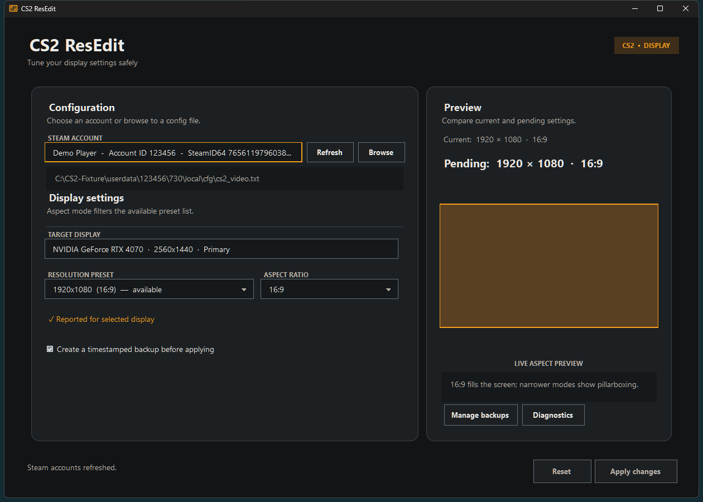

<div align="center">

# CS2 ResEdit

A safe, native Windows editor for Counter-Strike 2 display settings.

[](https://github.com/Softhe/CS2-ResEdit/releases/latest)
[](#requirements)
[](#development)
[](https://github.com/Softhe/CS2-ResEdit/actions/workflows/test.yml)
[](LICENSE)

### [Download CS2-ResEdit.exe](https://github.com/Softhe/CS2-ResEdit/releases/latest/download/CS2-ResEdit.exe)

[All releases](https://github.com/Softhe/CS2-ResEdit/releases) ·
[SHA-256 checksum](https://github.com/Softhe/CS2-ResEdit/releases/latest/download/CS2-ResEdit.exe.sha256)

</div>

<p align="center">
  
</p>

## About

CS2 ResEdit finds the local video configuration for each Steam account and changes resolution and aspect ratio without manual VDF editing. Version 1.0 is a portable, self-contained C#/.NET 10 WinForms application with a warm graphite interface, orange accents, and sharp per-monitor high-DPI rendering.

The application runs locally and requires no PowerShell runtime, separate .NET installation, administrator rights, API key, installer, or network connection.

| Capability | Behavior |
| --- | --- |
| Steam discovery | Lists local persona names, Account IDs, SteamID64 values, and configuration availability. |
| Display modes | Detects active displays, prioritizes Windows-supported modes, retains 43 curated presets, and accepts validated custom dimensions. |
| Recommended presets | Defaults to `1280x960`, `1920x1080`, or `1680x1050` when changing aspect families. |
| Live preview | Compares current and pending settings and previews the pending display shape. |
| Safe updates | Preserves encoding, BOM state, line endings, and unrelated VDF content during atomic replacement. |
| Recovery | Creates timestamped backups by default and supports previewed, rollback-safe restoration. |
| Local preferences | Remembers the last account and up to five recent valid custom files. |
| Diagnostics | Copies or exports a privacy-safe support report without identifiers, paths, or configuration contents. |

## Quick start

1. [Download `CS2-ResEdit.exe`](https://github.com/Softhe/CS2-ResEdit/releases/latest/download/CS2-ResEdit.exe).
2. Close Counter-Strike 2 so the game cannot overwrite the configuration when it exits.
3. Place the executable anywhere convenient and run it.
4. Select a discovered Steam account or choose **Browse** to open a `cs2_video.txt`.
5. Select the target display, aspect family, and resolution, review the pending settings, then choose **Apply changes**.

No installation is required. The usual configuration location is:

```text
C:\Program Files (x86)\Steam\userdata\<AccountID>\730\local\cfg\cs2_video.txt
```

The executable is currently unsigned, so Windows SmartScreen may display a warning. Verify the SHA-256 checksum against the published sidecar before choosing **More info** and **Run anyway**.

## Presets and aspect ratios

Changing the aspect family filters the preset list and selects a common starting resolution:

- `4:3 / 5:4` → `1280x960`
- `16:9` → `1920x1080`
- `16:10` → `1680x1050`

Windows-supported modes for the selected target display appear first. Every curated preset remains available afterward and is marked when Windows did not report it. The catalog ranges from low-resolution modes such as `640x480` and `800x600` through 4K-class modes. Choose **Custom resolution** to enter exact dimensions within the validated range.

The target display affects availability guidance only; the editor does not modify CS2 monitor-selection fields.

## Privacy-safe diagnostics

Choose **Diagnostics** to review a local support summary. Use **Copy** for the readable report or **Export JSON** for a versioned machine-readable report.

Reports include the app/OS architecture, display and mode counts, Steam discovery counts, and configuration format status. They exclude Steam names and identifiers, file paths, configuration contents, and preferences.

## Back up and restore

The **Create a timestamped backup before applying** option is enabled by default. Each successful change creates a backup beside the active configuration.

Choose **Manage backups** to inspect available editor backups and restore one. A restore is validated before use and creates a rollback backup of the current file first, so the operation can be reversed.

## Safety, backups, and privacy

- The editor validates the required resolution fields before modifying a file and remains compatible with current files that omit the retired legacy aspect-mode field.
- Updates are prepared in memory, written to a temporary file, and atomically replace the active configuration.
- The original encoding (UTF-8 or UTF-16), BOM state, and CRLF/LF line endings are preserved.
- Backups use `cs2_video.txt.<yyyyMMdd-HHmmss>.bak`; the newest five recognized editor backups are retained.
- Unrelated `.bak` files are never pruned.
- Steam names and identifiers are read locally and are never uploaded.
- Preferences contain no credentials and remain at:

```text
%LOCALAPPDATA%\Softhe\CS2-ResEdit\v1\settings.json
```

Version 1 starts with fresh preferences at this path. Preference files from other product names or unversioned folders are neither imported nor modified.

## Verify the download

Download the executable and checksum into the same directory, then run:

```powershell
$expected = (Get-Content .\CS2-ResEdit.exe.sha256).Split()[0]
$actual = (Get-FileHash .\CS2-ResEdit.exe -Algorithm SHA256).Hash.ToLowerInvariant()
$actual -eq $expected
```

The result should be `True`.

Checksum verification confirms that the downloaded file matches the GitHub release asset. Because the executable is unsigned, it does not provide publisher identity verification.

## Requirements

- Windows 10 or Windows 11, x64
- Counter-Strike 2 installed through Steam, or a valid `cs2_video.txt`

## Troubleshooting

### No Steam account appears

Choose **Refresh** after Steam has been started at least once. If the account still does not appear, choose **Browse** and open its `cs2_video.txt` directly.

### Apply changes is disabled

The button remains disabled until the pending settings differ from the current file and both custom dimensions are valid. Select another preset or enter valid width and height values.

### The game restores the previous resolution

Close Counter-Strike 2 before applying a change. The game can overwrite `cs2_video.txt` with its in-memory settings when it exits.

### A change needs to be undone

Choose **Manage backups**, select the appropriate timestamped backup, preview it, and restore it. The editor creates an additional rollback backup before restoration.

## Current limitations

- Windows 10/11 x64 only
- GUI-only; command-line automation is not included
- Unsigned executable; SmartScreen may warn on first launch
- Local Steam installations and manually selected configuration files only

## Development

Install the .NET SDK selected by `global.json`, then run:

```powershell
dotnet restore CS2-ResEdit.slnx --locked-mode
dotnet build CS2-ResEdit.slnx -c Release --no-restore
dotnet test CS2-ResEdit.slnx -c Release --no-build --no-restore
.\build\Publish.ps1
```

The solution separates the WinForms UI, reusable configuration/Steam/preferences core, and xUnit tests. `build\Publish.ps1` runs the tests and produces:

- `dist\CS2-ResEdit.exe`
- `dist\CS2-ResEdit.exe.sha256`

Pushing a tag that matches the application version runs the test workflow and publishes both verified assets as a GitHub release.

## License

CS2 ResEdit is free software licensed under the [GNU General Public License v3.0](LICENSE).
