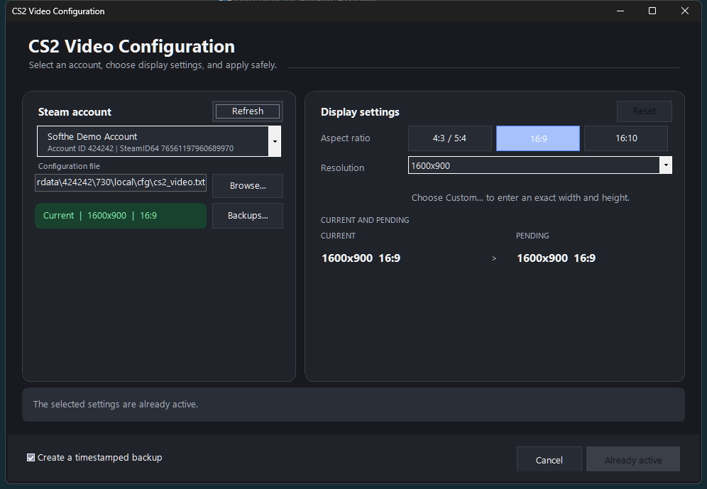

<div align="center">

# CS2 Video Config Editor

**Safely edit Counter-Strike 2 resolution settings with a modern Windows interface.**

[](https://learn.microsoft.com/powershell/)
[](#requirements)
[](#requirements)

### [Download the latest version](https://github.com/Softhe/CS2-VideoConfig-Editor/releases/latest/download/CS2-VideoConfig-Editor.zip)

[SHA-256 checksum](https://github.com/Softhe/CS2-VideoConfig-Editor/releases/latest/download/CS2-VideoConfig-Editor.zip.sha256)

</div>



## Why use it?

CS2 Video Config Editor finds the video configuration for each local Steam account and lets you change resolution settings without manually editing Valve configuration files.

- Detects multiple Steam accounts and shows their local PersonaName, Account ID, and SteamID64.
- Provides common `4:3 / 5:4`, `16:9`, and `16:10` presets plus custom dimensions.
- Validates the selected `cs2_video.txt` before enabling changes.
- Preserves the file encoding and line endings.
- Writes changes atomically and creates a timestamped backup by default.
- Warns if CS2 is running and may overwrite the configuration later.
- Includes graphical, interactive console, and automation-friendly command-line modes.
- Uses only Windows PowerShell/PowerShell and built-in .NET assemblies.

Account names are read locally from Steam's `loginusers.vdf`. No Steam Web API key or network account lookup is required.

## Quick start

1. [Download the latest ZIP](https://github.com/Softhe/CS2-VideoConfig-Editor/releases/latest/download/CS2-VideoConfig-Editor.zip).
2. Extract it anywhere.
3. Run `CS2-VideoConfig-Editor.ps1` with Windows PowerShell or PowerShell.
4. Select your Steam account and display settings, then choose **Apply changes**.

If Windows marks the downloaded script as blocked, right-click the ZIP before extracting it, choose **Properties**, select **Unblock**, and apply the change. You can also run:

```powershell
Unblock-File .\CS2-VideoConfig-Editor.ps1
```

## Command-line usage

Launch the graphical editor:

```powershell
.\CS2-VideoConfig-Editor.ps1
```

Open the interactive console editor:

```powershell
.\CS2-VideoConfig-Editor.ps1 -Console
```

Apply a preset automatically:

```powershell
.\CS2-VideoConfig-Editor.ps1 -Preset 1920x1080
```

Set an explicit aspect mode and configuration file:

```powershell
.\CS2-VideoConfig-Editor.ps1 `
  -FilePath 'C:\Program Files (x86)\Steam\userdata\123456\730\local\cfg\cs2_video.txt' `
  -Preset 1440x1080 `
  -AspectRatioMode 4:3
```

List discovered accounts:

```powershell
.\CS2-VideoConfig-Editor.ps1 -ListAccounts
```

Useful switches:

| Option | Purpose |
| --- | --- |
| `-FilePath <path>` | Use a specific `cs2_video.txt`. |
| `-SteamRoot <path>` | Search a nonstandard Steam installation. |
| `-Preset <width>x<height>` | Apply a preset or custom resolution. |
| `-AspectRatioMode <value>` | Use `4:3`, `16:9`, `16:10`, or modes `0`, `1`, `2`. |
| `-NoBackup` | Apply without retaining a timestamped backup. |
| `-Silent` | Suppress informational output; requires `-Preset`. |

## Requirements

- Windows 10 or Windows 11
- Windows PowerShell 5.1 or PowerShell 7+
- Counter-Strike 2 installed through Steam, or an explicit path to a valid `cs2_video.txt`

No installation, administrator rights, API key, or third-party PowerShell module is required.

## Safety

Close CS2 before applying a change. A running game can overwrite its configuration when it exits. Backups are stored next to the original file with a timestamped `.bak` suffix and can be restored by replacing `cs2_video.txt` with the backup.

## Download

The latest packaged script and its SHA-256 checksum are available from [GitHub Releases](https://github.com/Softhe/CS2-VideoConfig-Editor/releases/latest). The repository also contains the standalone PowerShell source for inspection and direct use.

## Project roadmap

See the [five-step roadmap to v2.0](ROADMAP.md) for the planned architecture, testing, recovery, usability, and release-engineering work.
